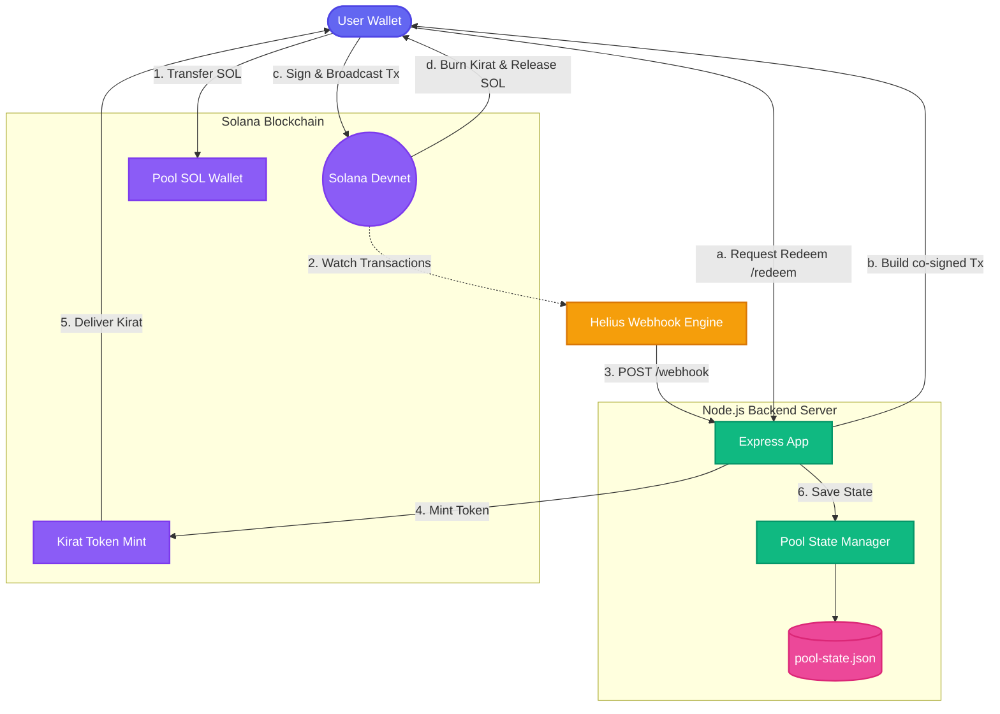
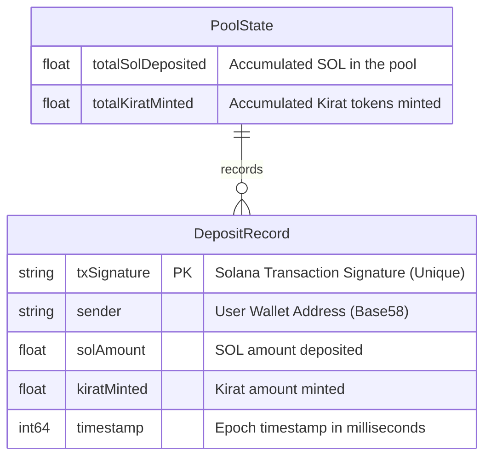
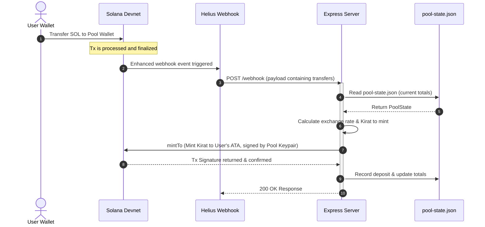
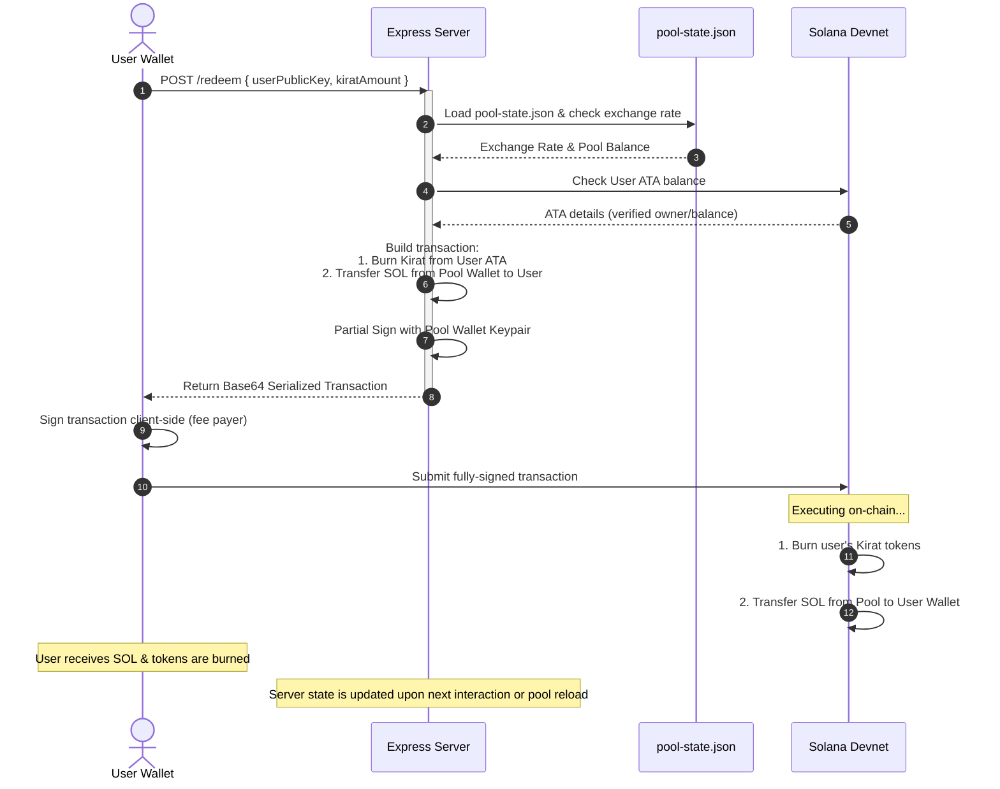

# Kirat — Centralized Liquid Staking Token on Solana

**Kirat** is a centralized liquid staking token (LST) built on Solana devnet. Users deposit SOL into a pool wallet and receive **Kirat** SPL tokens in return. Those tokens can later be redeemed (burned) to withdraw SOL, at a rate that tracks the pool's total value.

---

## How It Works

### System Architecture
The following diagram illustrates how the components of the centralized liquid staking token system interact:



---

## Data Schema & ERD

Since this is a centralized liquid staking pool, state is stored on the local disk inside `pool-state.json`. The following entity-relationship diagram shows the schema structure:



---

## Detailed Sequence Flows

### 1. Deposit & Mint Flow (Automated via Webhook)
When a user deposits SOL into the pool, Helius detects the event and informs our server, which automates the minting of Kirat tokens at the current exchange rate:



### 2. Redeem & Burn Flow (Co-Signed Transaction)
To withdraw SOL, the user initiates a redemption request. The server builds a transaction that burns Kirat and releases SOL, co-signing it before returning it to the user for final signing and broadcast:



---

## Exchange Rate Formula

The exchange rate is dynamic and updates automatically:

$$\text{exchangeRate} = \frac{\text{totalSOLInPool}}{\text{totalKiratMinted}}$$

- **Initial State**: Starts at **1 SOL = 1 Kirat** when no tokens have been minted yet.
- **Accruing Value**: As staking rewards accrue (e.g. SOL added to the pool without minting new tokens), the rate increases — meaning each Kirat becomes worth more than 1 SOL.
- **No minimum deposit**: Any amount of SOL is allowed.

---

## Prerequisites

| Requirement | Version |
|---|---|
| **Node.js** | 18 or later |
| **npm** | 9 or later |
| **Helius API Key** | Free tier at [helius.dev](https://helius.dev) |
| **ngrok** (or similar) | To expose localhost during dev |

---

## Setup

### 1. Clone the repository

```bash
git clone https://github.com/your-username/kirat-lst.git
cd kirat-lst
```

### 2. Install dependencies

```bash
npm install
```

### 3. Configure environment

```bash
cp .env.example .env
```

Open `.env` and fill in your **Helius API key**. The rest can remain default for now.

### 4. Create the Kirat token mint & pool wallet

```bash
npm run create-mint
```

This generates the pool wallet keypair (saved to `pool-wallet.json`) and creates the **Kirat** SPL token mint on devnet. Copy the printed **mint address** and paste it into your `.env` as `MINT_ADDRESS`.

### 5. Start the server

```bash
npm run dev
```

The server starts on `http://localhost:3000` by default.

### 6. Expose with ngrok

```bash
ngrok http 3000
```

Copy the **https** forwarding URL (e.g. `https://abc123.ngrok-free.app`).

### 7. Set the webhook URL

Add the ngrok URL to your `.env`:

```
WEBHOOK_URL=https://abc123.ngrok-free.app
```

### 8. Register the Helius webhook

```bash
npm run setup-webhook
```

You should see a confirmation with the webhook ID.

### 9. Test it!

Send some devnet SOL to the pool wallet address (printed on server startup) and watch the logs — Kirat tokens will be minted automatically.

---

## API Endpoints

### `GET /health`

Liveness probe.

```json
{ "status": "ok", "timestamp": "2026-06-03T08:37:00.000Z" }
```

### `GET /pool`

Returns the current pool state.

```json
{
  "totalSolDeposited": 10.5,
  "totalKiratMinted": 10.5,
  "exchangeRate": 1.0,
  "poolWalletAddress": "...",
  "mintAddress": "..."
}
```

### `POST /webhook`

Receives Helius enhanced webhook payloads. Returns `200 OK` immediately, then processes transfers asynchronously. **Do not call manually** — Helius calls this endpoint automatically.

### `POST /redeem`

Burns Kirat tokens and returns SOL.

**Request:**

```json
{
  "userPublicKey": "<base58 public key>",
  "kiratAmount": 5.0
}
```

**Response:**

```json
{
  "transaction": "<base64-encoded serialized transaction>"
}
```

The returned transaction must be **signed by the user** on the client side and submitted to the Solana network.

---

## Project Structure

```
├── src/
│   ├── index.ts              # Express server entry point
│   ├── config/
│   │   └── index.ts           # Environment & app configuration
│   ├── token/
│   │   ├── createMint.ts      # Script: create SPL mint + pool wallet
│   │   └── mint.ts            # Mint / burn / pool-state logic
│   └── webhook/
│       └── handler.ts         # Helius webhook handler
├── scripts/
│   └── setup-webhook.ts       # Register Helius webhook
├── .env.example               # Environment variable template
├── package.json
├── tsconfig.json
└── README.md
```

---

## Environment Variables

| Variable | Description | Default |
|---|---|---|
| `PORT` | Server port | `3000` |
| `SOLANA_NETWORK` | Solana cluster URL | devnet |
| `HELIUS_API_KEY` | Your Helius API key | — |
| `WEBHOOK_URL` | Public URL where the server is reachable | — |
| `MINT_ADDRESS` | Kirat SPL token mint address | — |
| `POOL_WALLET_PATH` | Path to pool wallet keypair JSON | `pool-wallet.json` |

---

## Tech Stack

- **Solana** — web3.js + spl-token
- **Express** — HTTP server
- **Helius** — Enhanced webhooks for real-time transaction monitoring
- **TypeScript** — Type safety throughout
- **tsx** — Fast TypeScript execution for development

---

## License

MIT © 2026
